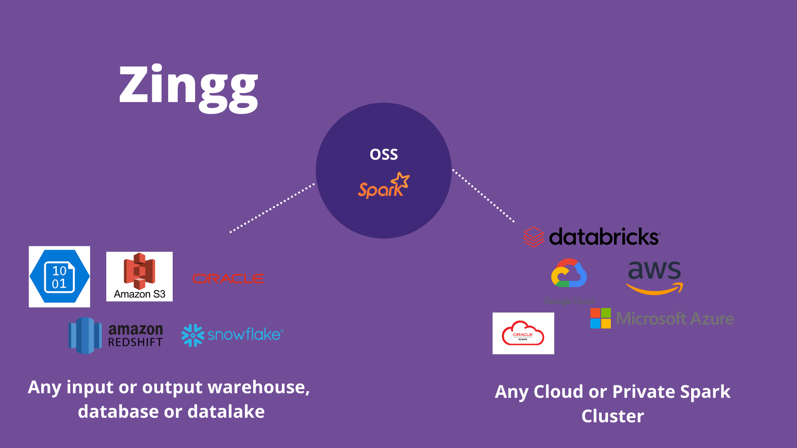
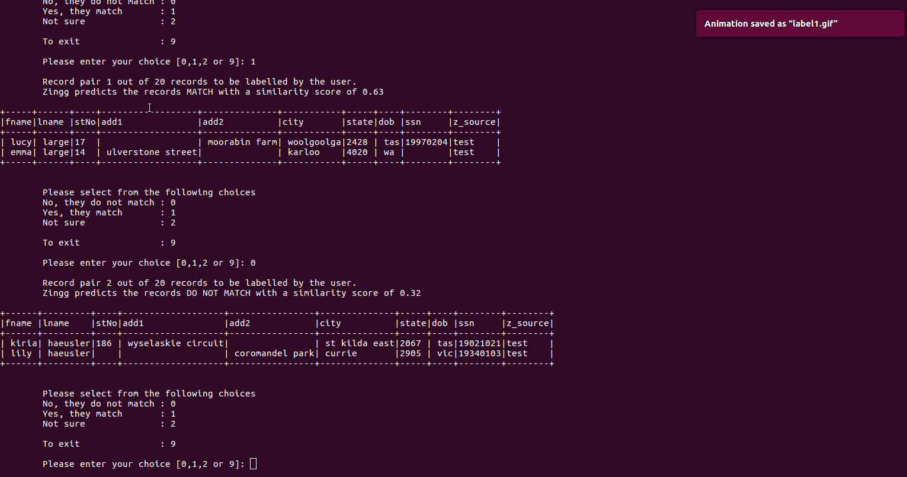

## The Problem

Real world data contains multiple records belonging to the same customer. These records can be in single or multiple systems and they have variations across fields, which makes it hard to combine them together, especially with growing data volumes. This hurts [customer analytics](docs/bizLeaderSurvey.md) - establishing lifetime value, loyalty programs, or marketing channels is impossible when the base data is not linked. No AI algorithm for segmentation can produce the right results when there are multiple copies of the same customer lurking in the data. No warehouse can live up to its promise if the dimension tables have duplicates. 


With a modern data stack and DataOps, we have established patterns for E and L in ELT for building data warehouses, datalakes and deltalakes. However, the T - getting data ready for analytics still needs a lot of effort. Modern tools like dbt are actively and successfully addressing this. What is also needed is a quick and scalable way to build the single source of truth of core business entities post Extraction and pre or post Loading.

With Zingg, the analytics engineer and the data scientist can quickly integrate data silos and build unified views at scale!


Besides probabilistic matching, also known as fuzzy matching, Zingg also does deterministic matching, which is useful in identity resolution and householding applications.


## Why Zingg

Zingg is an ML based tool for entity resolution. The following features set Zingg apart from other tools and libraries: 
- Ability to handle any entity like customer, patient, supplier, product etc 
- Ability to connect to [disparate data sources](https://docs.zingg.ai/zingg/connectors). Local and cloud file systems in any format, enterprise applications and relational, NoSQL and cloud databases and warehouses
- Ability to scale to large volumes of data. [See why this is important](https://docs.zingg.ai/zingg/zmodels/) and [Zingg performance numbers](https://docs.zingg.ai/zingg/stepbystep/hardwaresizing)
- [Interactive training data builder](https://docs.zingg.ai/zingg/stepbystep/createtrainingdata/label) using active learning that builds models on frugally small training samples to high accuracy.
 
- Ability to define domain specific functions to improve matching  
- Out of the box support for English as well as Chinese, Thai, Japanese, Hindi and other languages

Zingg is useful for
- Building unified and trusted views of customers and suppliers across multiple systems
- Large Scale Entity Resolution for AML, KYC and other fraud and compliance scenarios
- [Deduplication](docs/patient.md) and data quality
- Identity Resolution 
- Integrating data silos during mergers and acquisitions
- Data enrichment from external sources
- Establishing customer [households](docs/households.md)

## The Story

What is the [backstory behind Zingg](https://sonalgoyal.substack.com/p/time-to-zingg)? 

## Documentation

Check the detailed Zingg [documentation](https://docs.zingg.ai/zingg/) 

## Community

Be part of the conversation in the [Zingg Community Slack](https://join.slack.com/t/zinggai/shared_invite/zt-w7zlcnol-vEuqU9m~Q56kLLUVxRgpOA)

## People behind Zingg

Zingg is being developed by the [Zingg.AI](https://www.zingg.ai) team. If you need [custom help with or around Zingg](https://www.zingg.ai/company/consulting), let us know. 

## Demo

See Zingg in action [here](https://www.youtube.com/watch?v=zOabyZxN9b0)

## Getting Started

The easiest way to get started with Zingg is through Docker and by running the prebuilt models.
```
docker pull zingg/zingg:0.3.4
docker run -it zingg/zingg:0.3.4 bash
./scripts/zingg.sh --phase match --conf examples/febrl/config.json
``` 

Check the [step by step guide](https://docs.zingg.ai/zingg/stepbystep) for more details.

## Connectors

Zingg connects, reads and writes to most on-premise and cloud data sources. Zingg runs on any private or cloud based Spark service.


Zingg can read and write to Snowflake, Cassandra, S3, Azure, Elastic, major RDBMS and any Spark supported data sources. Zingg also works with all major file formats including Parquet, Avro, JSON, XLSX, CSV & TSV. This is done through the Zingg [pipe](docs/dataSourcesAndSinks/pipes.md) abstraction.  

## Key Zingg Concepts

Zingg learns 2 models on the data:

1. Blocking Model

One fundamental problem with scaling data mastering is that the number of comparisons increase quadratically as the number of input record increases.


Zingg learns a clustering/blocking model which indexes near similar records. This means that Zingg does not compare every record with every other record. Typical Zingg comparisons are 0.05-1% of the possible problem space.

2. Similarity Model 

The similarity model helps Zingg predict which record pairs match. Similarity is run only on records within the same block/cluster to scale the problem to larger datasets. The similarity model is a classifier which predicts similarity between records that are not exactly the same, but could belong together.

 

To build these models, training data is needed. Zingg comes with an interactive learner to rapidly build training sets. 

 

## Pretrained models

Zingg comes with pretrained models for the Febrl dataset under the [models](models) folder.

## Reporting bugs and contributing 

Want to report a bug or request a feature? Let us know on [Slack](https://join.slack.com/t/zinggai/shared_invite/zt-w7zlcnol-vEuqU9m~Q56kLLUVxRgpOA), or open an [issue](https://github.com/zinggAI/zingg/issues/new/choose)

Want to commit code? Please check the [contributing documentation.](https://docs.zingg.ai/zingg/contributing)

## Book Office Hours

If you want to schedule a 30-min call with our team to help you understand if Zingg is the right technology for your problem, please book a slot [here](https://calendly.com/sonalgoyal/30min). 

## Asking questions on running Zingg

If you have a question or issue while using Zingg, kindly log a [question](https://github.com/zinggAI/zingg/issues/new/choose) and we will reply very fast :-) 
Or you can use [Slack](https://join.slack.com/t/zinggai/shared_invite/zt-w7zlcnol-vEuqU9m~Q56kLLUVxRgpOA)

## License

Zingg is licensed under [AGPL v3.0](https://www.gnu.org/licenses/agpl-3.0.en.html) - which means you have the freedom to distribute copies of free software (and charge for them if you wish), that you receive source code or can get it if you want it, that you can change the software or use pieces of it in new free programs, and that you know you can do these things.

AGPL allows unresticted use of Zingg by end users and solution builders and partners. We strongly encourage solution builders to create custom solutions for their clients using Zingg.   

Need a different license? Write to us.


## Acknowledgements

Zingg would not have been possible without the excellent work below:
- [Apache Spark](https://spark.apache.org)
- [SecondString](http://secondstring.sourceforge.net/)
- [Febrl](http://users.cecs.anu.edu.au/~Peter.Christen/Febrl/febrl-0.3/febrldoc-0.3/)

