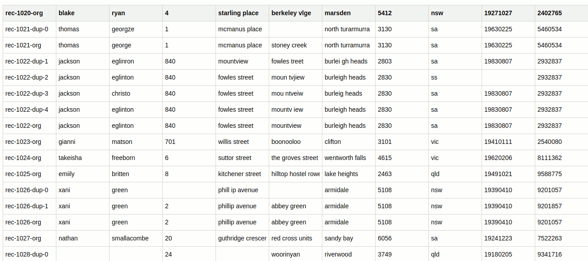

## Configuration
{: .no_toc }

 Zingg comes with a command line script that invokes spark-submit. This script needs a json configuration file to define the input data and match types, location of training data, models and output. 

Sample configuration files are defined at examples/febrl and examples/febrl120k


## Table of contents
{: .no_toc .text-delta }

1. TOC
{:toc}

Here are the json variables which you will need to define to work with your data.

### data

Array of input data. Each array entry here refers to a [Zingg Pipe](dataSourcesAndSinks/pipes.md). If the data is self describing, for eg avro or parquet, there is no need to define the schema. Else field definitions with name and types need to be provided. 

For example for the csv under [examples/febrl/test.csv](examples/febrl/test.csv) 

```json
 "data" : [ {
    "name" : "test",
    "format" : "csv",
    "props" : {
      "delimiter" : ",",
      "header" : "true",
      "location" : "examples/febrl/test.csv"
    },
    "schema" : "{
      \"type\":\"struct\",
      \"fields\":[
      {\"name\":\"id\",\"type\":\"string\",\"nullable\":true,\"metadata\":{}},
      {\"name\":\"firstName\",\"type\":\"string\",\"nullable\":true,\"metadata\":{}},
      {\"name\":\"lastName\",\"type\":\"string\",\"nullable\":true,\"metadata\":{}},
      {\"name\":\"streetnumber\",\"type\":\"string\",\"nullable\":true,\"metadata\":{}},
      {\"name\":\"street\",\"type\":\"string\",\"nullable\":true,\"metadata\":{}},
      {\"name\":\"address1\",\"type\":\"string\",\"nullable\":true,\"metadata\":{}},
      {\"name\":\"address2\",\"type\":\"string\",\"nullable\":true,\"metadata\":{}},
      {\"name\":\"areacode\",\"type\":\"string\",\"nullable\":true,\"metadata\":{}},
      {\"name\":\"stateCode\",\"type\":\"string\",\"nullable\":true,\"metadata\":{}},
      {\"name\":\"dateOfbirth\",\"type\":\"string\",\"nullable\":true,\"metadata\":{}},
      {\"name\":\"ssn\",\"type\":\"string\",\"nullable\":true,\"metadata\":{}}
      ]
      }"
  }
```

Read more about Zingg Pipes for datastore connections [here](pipes.md). 

### output
Definitions are same as [data](#data) but reflect where you want the Zingg output to get saved

### zinggDir

Location where trained models will be saved. Defaults to /tmp/zingg

### modelId 

Identifier for the model. You can train multiple models - say one for customers matching names, age and other personal details and one for households matching addresses. Each model gets saved under zinggDir/modelId

### fieldDefinition

Which fields from the source data to be used for matching, and what kind of matching they need. 

#### FUZZY 
Broad matches with typos, abbreviations and other variations. 

#### EXACT 
Less tolerant with variations, but would still match inexact strings to some degree. Preferable for country codes, pin codes and other categorical variables where you expect less variations

#### DONT_USE
Name says it :-) Appears in the output but no computation is done on these. Helpful for fields like ids which are required in the output.


````json
"fieldDefinition" : [ {
    "matchType" : "DONT_USE",
    "fieldName" : "id",
    "fields" : "id"
  },
  { 
    "matchType" : "FUZZY",
    "fieldName" : "firstName",
    "fields" : "firstName"
  }
  ]
````

In the above example, field id from input is present in the output but not used for comparisons.   

### numPartitions
Number of Spark partitions over which the input data is distributed. Keep it equal to the 20-30 times the number of cores. This is an important configuration for performance.

### labelDataSampleSize
Fraction of the data to be used for training the models. Adjust it between 0.0001 and 0.1 to keep the sample size small enough so that it finds enough edge cases fast. If the size is bigger, the findTrainingData job will spend more time combing through samples. If the size is too small, Zingg may not find the right edge cases. 
