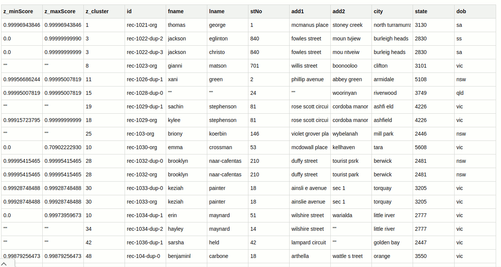

## Zingg Phases
Zingg runs Spark jobs for building training data(findTrainingData and label), building actual models(train) and applying these models on the data to get mastered entities(match). If you need to match records in one dataset against other, you can run the link phase. The phase to be run is passed as a command line argument. Here are more details about the phases and how they can be invoked.

### findTrainingData - finding pairs of records which could be similar to train Zingg
Zingg builds models to predict similarity. Training data is needed to build these models. The findTrainingData phase prompts Zingg to search for edge cases in the data. During findTrainingData, Zingg combs through the data samples and judiciously selects limited pairs for the user to mark. Zingg is very frugal about the training so that user effort is minimized and models can be built and deployed quickly.

This findTrainingData job writes the edge cases to the folder configured throgh zinggDir/modelId in the config. 

`./zingg.sh --phase findTrainingData --conf config.json`

### label - user feedback on the training pairs 
This phase opens an interactive learner where the user can mark the pairs found by findTrainingData phase as matches or non matches. 

`./zingg.sh --phase label --conf config.json`

 

The findTrainingData phase is run first and then the label phase is run and this cycle repeated so that the Zingg models get smarter from user feedback.This generates edge cases for labelling and the user marks them. At each stage, the user will get different variations of attributes across the records. 

Proceed till you have at least 30-40 positives, or when you see the predictions by Zingg converging with the output you want. Zingg performs pretty well with even small number of training, as the samples to be labelled are chosen by the algorithm itself. 

### train - training and saving the models
Builds up the Zingg models using the training data from the above phases and writes them to the folder zinggDir/modelId as specified in the config.

`./zingg.sh --phase train --conf config.json`

### match
Finds the records whioch match with each other. 

`./zingg.sh --phase match --conf config.json`

As can be seen in the image below, matching records are given the same z_cluster id. Each record also gets a z_minScore and z_maxScore which shows the least/greatest it matched with other records in the same cluster. 

### link

In many cases like reference data mastering, enrichment etc, 2 individual datasets are duplicate free but they need to be matched against each other. The link phase is used for such scenarios.

`./zingg.sh --phase link --conf config.json`

